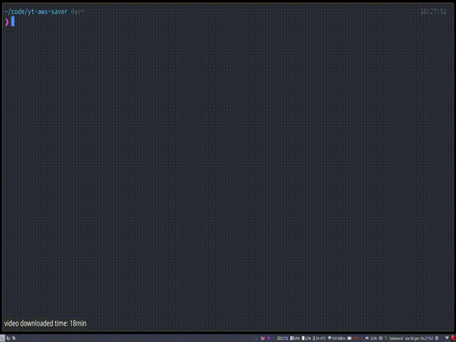

# 

<br>

# Motivation

This project was created as a **study case** to understand more about **streams**, **threads**, **queues**, **workers**, **concurrency** and **parallelism** in Node.js.

Key words: Study Case · Streams · Threads · Queues · Workers · Concurrency · Parallelism · Node.js · BullMQ · Typescript · Aws S3 · Docker · Redis

<br>

# Technologies

<a href="https://www.typescriptlang.org/" target="_blank">

</a>
<a href="https://nodejs.org/" target="_blank">
 
</a>
<a href="https://redis.io/" target="_blank">
 
</a>
</a>
<a href="https://www.docker.com/" target="_blank">

</a>
</a>
<a href="https://aws.amazon.com/pt/" target="_blank">

</a>

<br>

# How to use

## Requerimentos

- [docker](https://docs.docker.com/get-docker/) >= 20.10.0
- [docker-compose](https://docs.docker.com/compose/install/) >= 1.29
- [node](https://nodejs.org/en/download/) >= 18.12.x
- [pnpm](https://pnpm.io/installation) >= 7.x

<br>

## Inside the code

### 1. Clone the repository (suggest to use ssh)

```bash
git clone https://github.com/henriq4/yt-aws-saver.git
```

### 2. Install the project dependencies

```bash
pnpm i
```

### 3. Configure aws credentials (optional)

```ts
/* src/config/aws/index.ts */

const awsCredentials = {
  credentials: {
    accessKeyId: "your access key id",
    secretAccessKey: "your secret access key",
  },
  region: "your region",
  bucket: "bucket to save downloaded videos",
};

export { awsCredentials };
```

### 2. Run the cli

```bash
pnpm dev <video url>
```

<br>

# Roadmap

- [x] Download video
- [x] Typescrip typing
- [x] Upload video to Aws S3 service
- [x] Send video directly without save localy
- [x] Use chunks to work in parallel
- [x] Get video by Node.js argvs
- [x] Name uploaded video to video received name
- [x] Script to change aws credencials with is example configuration
- [ ] Apply queues and workers to receive more than one video (currently working...)
- [ ] Generate binary bundle with cli application

<br>

# Author

| [<br><sub>@henriq4</sub>](https://github.com/henriq4) |
| :----------------------------------------------------------------------------------------------------------------: |
